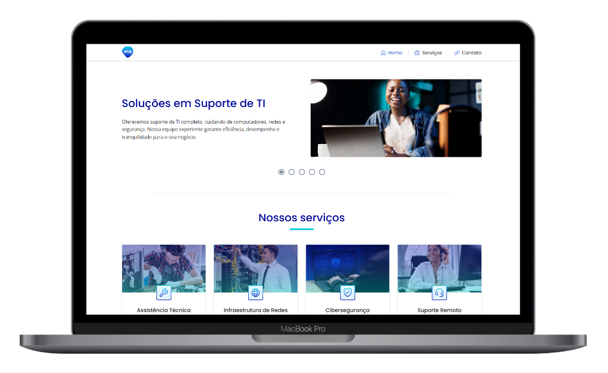

<h1 align="center">
	
</h1>

<p align="center">
	Digital solutions and IT services focused on performance, security, and reliability.
</p>

<p align="center">
	<a href="https://plug-ti.vercel.app/">
		
	</a>
	
	
	
</p>

<p align="center">
	
</p>

<p align="center">
	<a href="#-layout">Layout</a> •
	<a href="#-overview">Overview</a> •
	<a href="#-technologies">Technologies</a> •
	<a href="#-project-structure">Structure</a> •
	<a href="#-how-to-run">How to Run</a> •
	<a href="#-deploy">Deploy</a>
</p>

## 🔖 Layout

You can view the project layout through the link below:

- [Plug layout](https://www.figma.com/design/ucJvxsqNevWLSL5n2UugfN/Plug---Solu%C3%A7%C3%B5es-em-TI?node-id=185-2&t=8p9YsZceO88UpCF8-1)

Remembering that you need to have a [Figma](http://figma.com/) account to access it.

## 💻 Overview

**Plug - IT Solutions** is an institutional website for an IT services company focused on:

- **Support and maintenance**: technical support to keep systems stable and available.
- **Network infrastructure**: planning and implementation of secure, efficient networks.
- **Remote support**: fast issue resolution without on-site assistance.
- **Cybersecurity**: protection against digital threats and stronger data security.

## 🚀 Technologies

This project was built with:

- React + Vite
- TypeScript
- React Router
- React Hook Form + Zod
- Framer Motion (motion)
- CSS Modules

## 📂 Project Structure

```bash
├── public/
│   └── img/                # Logo, thumbnails and mockups used in README and app
├── src/
│   ├── @types/             # Global TypeScript declarations
│   ├── assets/             # Images, icons and static application files
│   ├── components/         # Reusable components (UI and page sections)
│   ├── contexts/           # Context API for shared state
│   ├── motion/             # Animation variants and transitions
│   ├── pages/              # Main pages
│   ├── routes/             # Route configuration
│   ├── schemas/            # Form validation schemas (Zod)
│   ├── styles/             # Global styles and themes
│   └── utils/              # Utility helpers
├── eslint.config.js
├── index.html
├── package.json
├── tsconfig.app.json
├── tsconfig.json
├── tsconfig.node.json
├── vite.config.ts
└── README.md
```

## 🔧 How to Run

### Prerequisites

- Node.js (LTS recommended)
- npm, yarn, or pnpm

### Installation

```bash
git clone https://github.com/seu-usuario/nome-do-projeto.git
cd nome-do-projeto
npm install
```

### Development

```bash
npm run dev
```

App available at: `http://localhost:5173`

### Production Build

```bash
npm run build
```

### Local Build Preview

```bash
npm run preview
```

## 📌 Application Sections

- **Home**: company presentation, value proposition, and highlights.
- **Services**: details of the services offered.
- **Contact**: form and contact information for lead conversion.

## 🚀 Deploy

Access the live version at: **https://plug-ti.vercel.app/**
